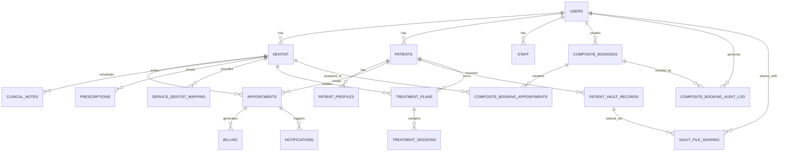

# Code Smiles - Entity Relationship Diagram (ERD)

**Generated:** May 24, 2026  
**Database:** PostgreSQL (code_smiles_db)  
**Total Tables:** 20

---

## 📊 Visual ERD (Mermaid Diagram)



---

## 🏗️ Database Architecture Overview

### Core Entity Groups

#### 1. **User Management** (Foundation Layer)
- **USERS** - Central user table for all system users
  - Stores authentication credentials
  - Supports multiple roles: patient, dentist, staff, admin
  - Tracks verification and password reset tokens

- **DENTIST** - Dentist-specific profile
  - Links to USERS via user_id (1:1 relationship)
  - Stores specialization, license, experience
  - Manages working hours and availability

- **PATIENTS** - Patient-specific profile
  - Links to USERS via user_id (1:1 relationship)
  - Stores medical history and emergency contacts
  - Tracks patient status and reliability score

- **STAFF** - Staff-specific profile
  - Links to USERS via user_id (1:1 relationship)
  - Stores position, department, permissions
  - Tracks hire date and employment status

#### 2. **Booking & Appointment Management** (Core Business Logic)
- **COMPOSITE_BOOKINGS** - Multi-appointment booking container
  - Groups multiple appointments into single booking
  - Tracks booking type, priority, source
  - Stores patient notes and staff notes
  - Links to USERS (patient_id, created_by)

- **COMPOSITE_BOOKING_APPOINTMENTS** - Individual appointments within composite booking
  - Stores appointment details (date, time, service)
  - Links to DENTIST for assignment
  - Tracks confirmation status and reminders
  - Maintains appointment sequence

- **APPOINTMENTS** - Legacy appointment table
  - Stores individual appointments
  - Links to DENTIST and PATIENTS
  - Tracks status, urgency, booking type
  - Manages reminder flags

- **COMPOSITE_BOOKING_AUDIT_LOG** - Booking audit trail
  - Tracks all changes to composite bookings
  - Records who made changes and when
  - Stores action details for compliance

#### 3. **Clinical & Medical Records**
- **CLINICAL_NOTES** - Doctor's notes
  - Links to DENTIST (dentist_id)
  - Stores note type and content
  - Timestamped for audit trail

- **PRESCRIPTIONS** - Medication prescriptions
  - Links to DENTIST (dentist_id)
  - Stores medication, dosage, frequency
  - Tracks prescription status

- **TREATMENT_PLANS** - Treatment planning
  - Links to DENTIST (dentist_id)
  - Stores plan title, description, status
  - Parent for treatment sessions

- **TREATMENT_SESSIONS** - Individual treatment sessions
  - Links to TREATMENT_PLANS (plan_id)
  - Stores session number, date, status
  - Contains session notes

#### 4. **Service Management**
- **SERVICE_DENTIST_MAPPING** - Service availability
  - Links DENTIST to services they provide
  - Tracks primary service and active status
  - Enables service-to-dentist assignment

#### 5. **Patient Information**
- **PATIENT_PROFILES** - Extended patient information
  - Links to PATIENTS (patient_id)
  - Stores DOB, gender, blood type, language preference
  - Tracks emergency contacts and notification preferences
  - Stores reliability score

- **PATIENT_VAULT_RECORDS** - Medical document storage
  - Stores patient medical records/documents
  - Tracks file metadata (name, size, type)
  - Supports multiple record types and categories

- **VAULT_FILE_SHARING** - Document sharing permissions
  - Links PATIENT_VAULT_RECORDS to shared recipients
  - Tracks permission levels and sharing dates
  - Supports access revocation

#### 6. **Billing & Notifications**
- **BILLING** - Invoice and payment tracking
  - Links to APPOINTMENTS and PATIENTS
  - Stores amount, payment status, payment method
  - Tracks discounts and due dates

- **NOTIFICATIONS** - User notifications
  - Links to USERS and APPOINTMENTS
  - Stores notification title, detail, level
  - Tracks read status

#### 7. **Support & FAQ**
- **SUPPORT_REQUESTS** - Customer support tickets
  - Links to USERS
  - Stores subject, message, status
  - Tracks creation and update timestamps

- **FAQS** - Frequently asked questions
  - Organized by category and role
  - Supports sorting

---

## 📋 Table Relationships Summary

### Primary Key Relationships

| From Table | To Table | Relationship | Type |
|---|---|---|---|
| USERS | DENTIST | 1:1 (user_id) | One user = One dentist |
| USERS | PATIENTS | 1:1 (user_id) | One user = One patient |
| USERS | STAFF | 1:1 (user_id) | One user = One staff |
| DENTIST | APPOINTMENTS | 1:N | One dentist → Many appointments |
| DENTIST | CLINICAL_NOTES | 1:N | One dentist → Many notes |
| DENTIST | PRESCRIPTIONS | 1:N | One dentist → Many prescriptions |
| DENTIST | SERVICE_DENTIST_MAPPING | 1:N | One dentist → Many services |
| DENTIST | TREATMENT_PLANS | 1:N | One dentist → Many plans |
| PATIENTS | PATIENT_PROFILES | 1:1 | One patient → One profile |
| PATIENTS | APPOINTMENTS | 1:N | One patient → Many appointments |
| PATIENTS | PATIENT_VAULT_RECORDS | 1:N | One patient → Many records |
| COMPOSITE_BOOKINGS | COMPOSITE_BOOKING_APPOINTMENTS | 1:N | One booking → Many appointments |
| COMPOSITE_BOOKINGS | COMPOSITE_BOOKING_AUDIT_LOG | 1:N | One booking → Many audit logs |
| TREATMENT_PLANS | TREATMENT_SESSIONS | 1:N | One plan → Many sessions |
| PATIENT_VAULT_RECORDS | VAULT_FILE_SHARING | 1:N | One record → Many shares |

---

## 🔑 Key Constraints & Unique Fields

### Unique Constraints (UK)
- **APPOINTMENTS.booking_id** - Unique booking identifier
- **COMPOSITE_BOOKINGS.booking_id** - Unique composite booking ID
- **COMPOSITE_BOOKING_APPOINTMENTS.appointment_id** - Unique appointment ID
- **PATIENTS.email** - Unique patient email
- **PATIENTS.user_id** - One-to-one with USERS
- **DENTIST.user_id** - One-to-one with USERS
- **STAFF.user_id** - One-to-one with USERS
- **SERVICE_DENTIST_MAPPING.service_name** - Unique service per dentist
- **SERVICE_DENTIST_MAPPING.dentist_id** - One service per dentist
- **VAULT_FILE_SHARING.vault_record_id** - One-to-one with vault record
- **VAULT_FILE_SHARING.shared_with_dentist_name** - Unique sharing relationship

### Foreign Key Constraints (FK)
- **APPOINTMENTS.patient_id** → USERS.id
- **APPOINTMENTS.dentist_id** → DENTIST.dentist_id
- **APPOINTMENTS.composite_booking_id** → COMPOSITE_BOOKINGS.id
- **CLINICAL_NOTES.dentist_id** → DENTIST.dentist_id
- **COMPOSITE_BOOKING_APPOINTMENTS.composite_booking_id** → COMPOSITE_BOOKINGS.id
- **COMPOSITE_BOOKING_APPOINTMENTS.dentist_id** → DENTIST.dentist_id
- **COMPOSITE_BOOKING_AUDIT_LOG.composite_booking_id** → COMPOSITE_BOOKINGS.id
- **COMPOSITE_BOOKING_AUDIT_LOG.action_by** → USERS.id
- **COMPOSITE_BOOKINGS.patient_id** → USERS.id
- **COMPOSITE_BOOKINGS.created_by** → USERS.id
- **DENTIST.user_id** → USERS.id
- **PATIENT_PROFILES.patient_id** → PATIENTS.patient_id
- **PATIENTS.user_id** → USERS.id
- **PRESCRIPTIONS.dentist_id** → DENTIST.dentist_id
- **SERVICE_DENTIST_MAPPING.dentist_id** → DENTIST.dentist_id
- **STAFF.user_id** → USERS.id
- **TREATMENT_PLANS.dentist_id** → DENTIST.dentist_id
- **VAULT_FILE_SHARING.vault_record_id** → PATIENT_VAULT_RECORDS.id
- **VAULT_FILE_SHARING.patient_id** → USERS.id
- **VAULT_FILE_SHARING.shared_with_user_id** → USERS.id

---

## 📊 Data Flow Patterns

### Booking Flow
```
USERS (Patient) 
  ↓
COMPOSITE_BOOKINGS (Create booking)
  ↓
COMPOSITE_BOOKING_APPOINTMENTS (Add appointments)
  ↓
DENTIST (Assign dentist)
  ↓
APPOINTMENTS (Legacy record)
  ↓
BILLING (Generate invoice)
  ↓
NOTIFICATIONS (Send confirmation)
```

### Clinical Records Flow
```
APPOINTMENTS (Scheduled)
  ↓
CLINICAL_NOTES (Doctor writes notes)
  ↓
PRESCRIPTIONS (Issue medication)
  ↓
TREATMENT_PLANS (Create plan)
  ↓
TREATMENT_SESSIONS (Track sessions)
```

### Document Sharing Flow
```
PATIENTS (Patient uploads)
  ↓
PATIENT_VAULT_RECORDS (Store document)
  ↓
VAULT_FILE_SHARING (Share with dentist)
  ↓
USERS (Recipient access)
```

---

## ⚠️ Schema Observations & Recommendations

### Current State
1. **Dual Appointment Tables**: Both APPOINTMENTS and COMPOSITE_BOOKING_APPOINTMENTS exist
   - APPOINTMENTS appears to be legacy
   - COMPOSITE_BOOKING_APPOINTMENTS is the new standard
   - Consider consolidating in future refactor

2. **Denormalization**: Several tables store denormalized data
   - APPOINTMENTS stores patient_name, email, phone (also in USERS/PATIENTS)
   - COMPOSITE_BOOKING_APPOINTMENTS stores dentist_name, patient_age
   - BILLING stores patient_name, service, dentist_name
   - This improves query performance but requires careful synchronization

3. **Missing Foreign Keys**:
   - BILLING.appointment_id has no FK constraint
   - BILLING.patient_id has no FK constraint
   - CLINICAL_NOTES.patient_id has no FK constraint
   - NOTIFICATIONS.user_id has no FK constraint
   - NOTIFICATIONS.appointment_id has no FK constraint
   - PATIENT_VAULT_RECORDS.patient_id has no FK constraint
   - PRESCRIPTIONS.patient_id has no FK constraint
   - TREATMENT_PLANS.patient_id has no FK constraint
   - TREATMENT_SESSIONS.plan_id has no FK constraint

4. **JSONB Fields**: 
   - DENTIST.working_days (stores schedule as JSON)
   - STAFF.permissions (stores permissions as JSON)
   - Good for flexibility, but consider normalization if complex queries needed

### Recommendations

1. **Add Missing Foreign Keys** (High Priority)
   ```sql
   ALTER TABLE billing ADD CONSTRAINT fk_billing_appointment 
     FOREIGN KEY (appointment_id) REFERENCES appointments(id);
   ALTER TABLE billing ADD CONSTRAINT fk_billing_patient 
     FOREIGN KEY (patient_id) REFERENCES users(id);
   ALTER TABLE clinical_notes ADD CONSTRAINT fk_clinical_notes_patient 
     FOREIGN KEY (patient_id) REFERENCES users(id);
   -- ... etc
   ```

2. **Consolidate Appointment Tables** (Medium Priority)
   - Migrate all APPOINTMENTS data to COMPOSITE_BOOKING_APPOINTMENTS
   - Update all references
   - Deprecate APPOINTMENTS table

3. **Add Indexes** (High Priority)
   - Index on frequently queried columns:
     - APPOINTMENTS.appointment_date
     - APPOINTMENTS.dentist_id
     - COMPOSITE_BOOKINGS.patient_id
     - COMPOSITE_BOOKINGS.overall_status
     - PATIENT_VAULT_RECORDS.patient_id

4. **Audit Trail Enhancement** (Medium Priority)
   - Consider adding audit triggers to track all data changes
   - Currently only COMPOSITE_BOOKING_AUDIT_LOG exists

5. **Soft Deletes** (Low Priority)
   - Consider adding deleted_at timestamps for data retention
   - Useful for compliance and historical analysis

---

## 📈 Statistics

- **Total Tables**: 20
- **Total Foreign Keys**: 18+
- **Total Unique Constraints**: 11
- **Denormalized Tables**: 4 (APPOINTMENTS, COMPOSITE_BOOKING_APPOINTMENTS, BILLING, PRESCRIPTIONS)
- **JSONB Fields**: 2 (DENTIST.working_days, STAFF.permissions)
- **Timestamp Fields**: 30+ (created_at, updated_at patterns)

---

## 🔍 Query Optimization Tips

1. **Booking Queries**: Use COMPOSITE_BOOKINGS + COMPOSITE_BOOKING_APPOINTMENTS (not legacy APPOINTMENTS)
2. **Patient History**: Join PATIENTS → PATIENT_PROFILES → PATIENT_VAULT_RECORDS
3. **Dentist Availability**: Query SERVICE_DENTIST_MAPPING + DENTIST.working_days
4. **Clinical Records**: Use CLINICAL_NOTES + PRESCRIPTIONS + TREATMENT_PLANS
5. **Audit Trail**: Always check COMPOSITE_BOOKING_AUDIT_LOG for booking changes

---

## 📝 Generated Files

- `erd-mermaid.md` - Mermaid diagram format
- `database-schema.md` - Detailed schema documentation
- `schema.json` - Machine-readable schema
- `CODE_SMILES_ERD.md` - This comprehensive guide

**Last Updated**: May 24, 2026
