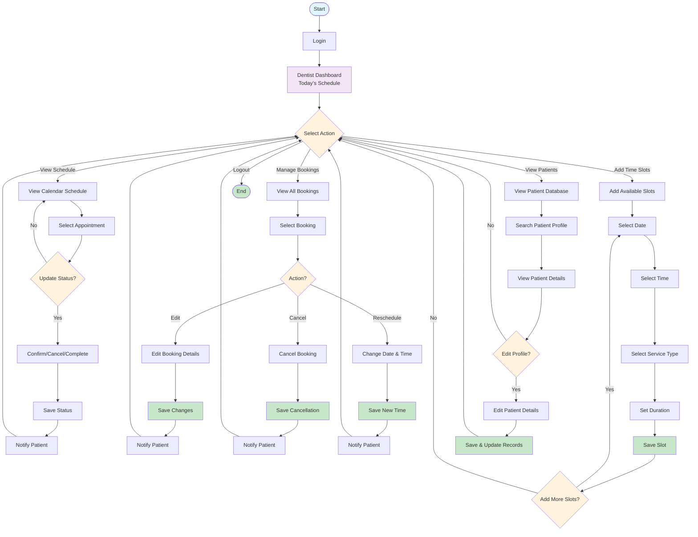

# Dentist Flowchart

## Dentist Features:

1. **View Schedule** - See today's appointments and update status
2. **Manage Bookings** - Edit, cancel, or reschedule appointments
3. **Add Time Slots** - Create available appointment slots
4. **View Patients** - Search and manage patient profiles
5. **Logout** - Exit the system

---

## To Download:

1. Go to: https://mermaid.live
2. Paste the code above
3. Click download (⬇️)

