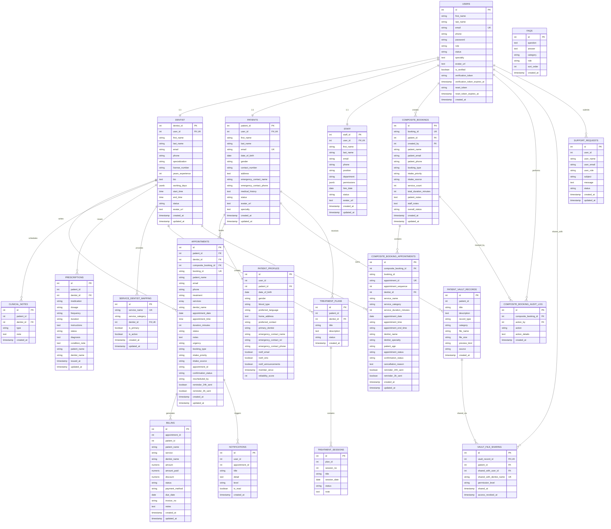
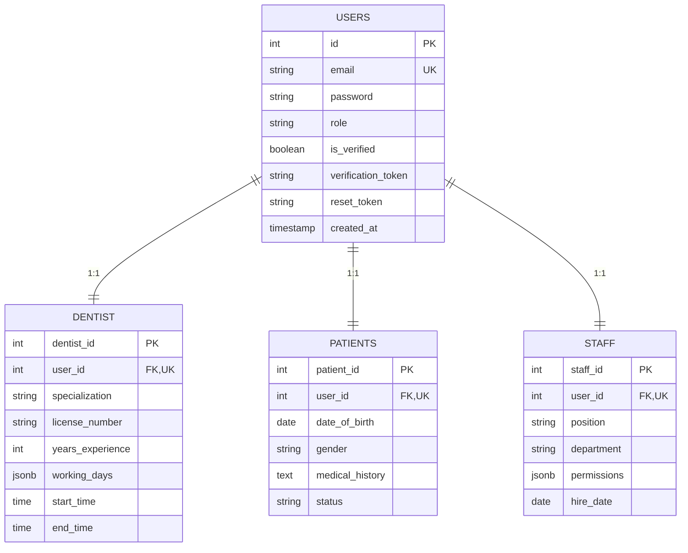
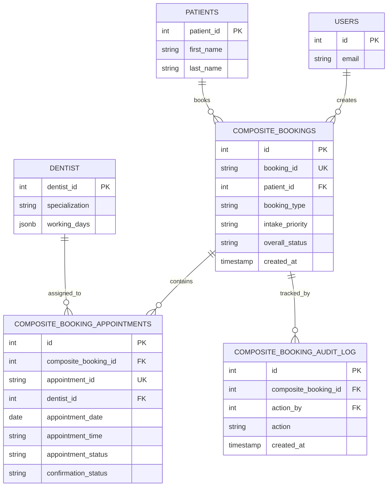
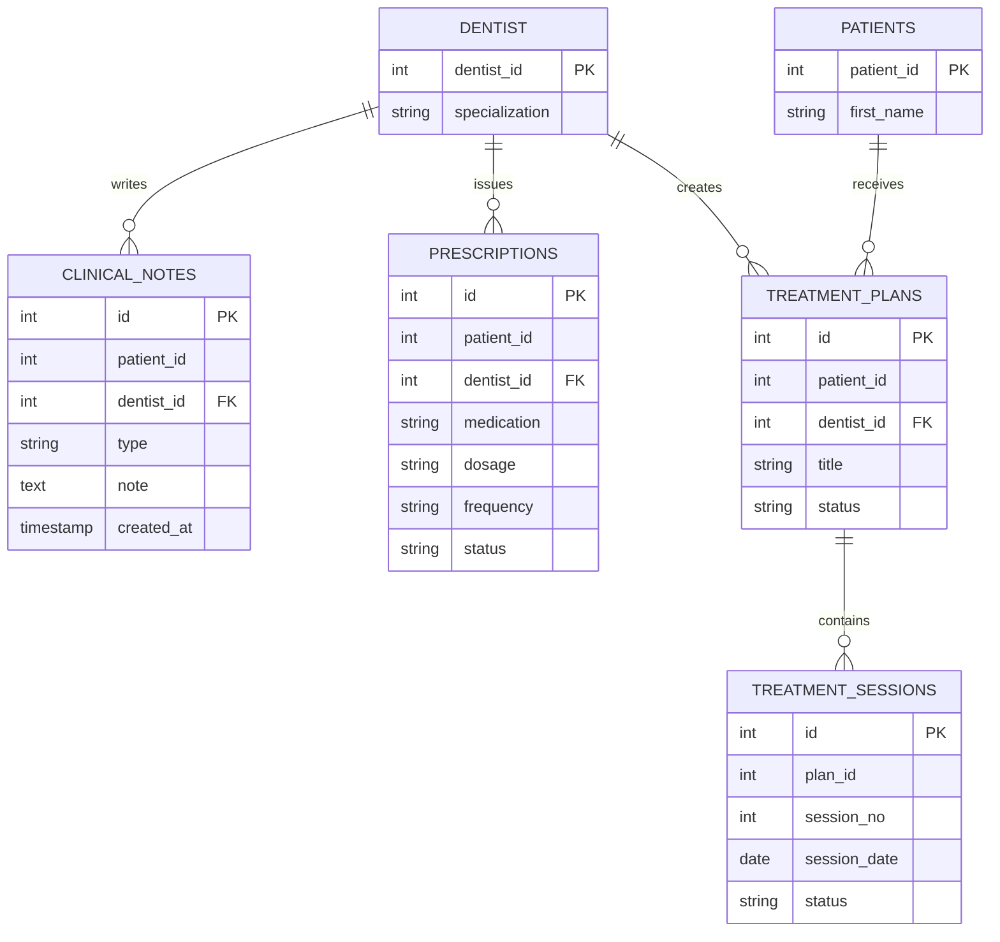
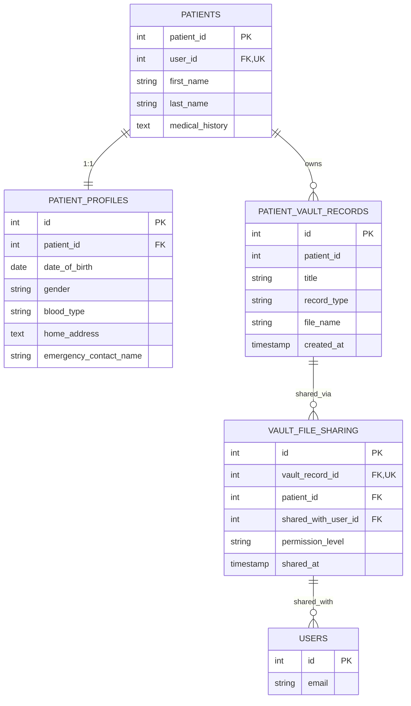
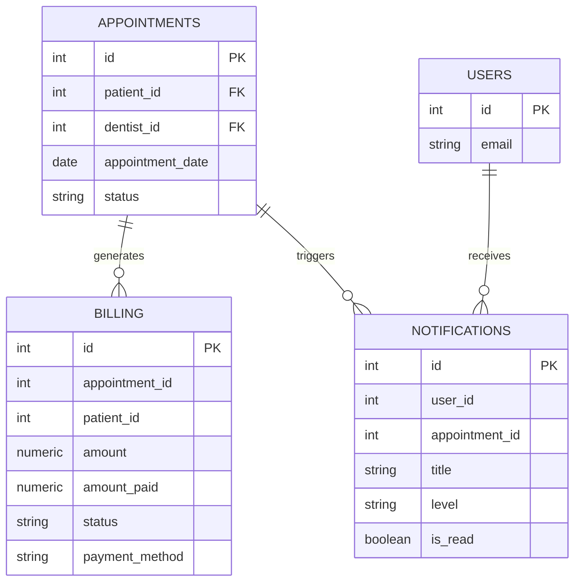
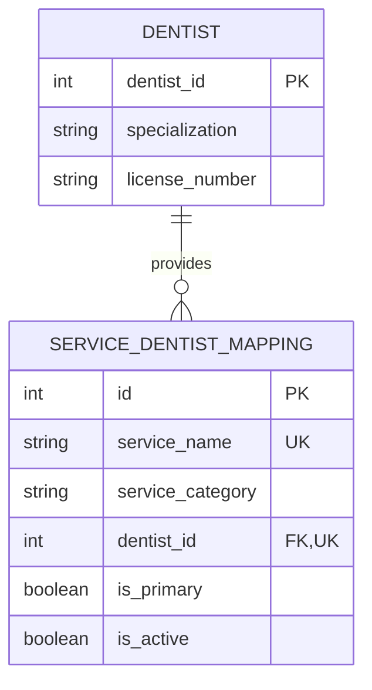

# Code Smiles ERD - Mermaid Live Format

## 🔗 How to Use These Diagrams

### Option 1: Mermaid Live Editor
1. Go to https://mermaid.live
2. Copy the diagram code below
3. Paste into the editor
4. Export as PNG, SVG, or share the link

### Option 2: GitHub/GitLab
- Paste the diagram code in any `.md` file
- It will render automatically

### Option 3: VS Code
- Install "Markdown Preview Mermaid Support" extension
- Open this file in preview mode

---

## 📊 Complete ERD Diagram



---

## 🎯 Simplified Views by Domain

### User Management & Authentication



### Booking & Appointment Management



### Clinical Records & Treatment



### Patient Information & Medical Vault



### Billing & Notifications



### Services & Dentist Mapping



---

## 📋 Legend

| Symbol | Meaning |
|--------|---------|
| `PK` | Primary Key |
| `FK` | Foreign Key |
| `UK` | Unique Key |
| `\|\|--\|\|` | One-to-One relationship |
| `\|\|--o{` | One-to-Many relationship |
| `}o--o{` | Many-to-Many relationship |

---

## 🔗 Direct Links to Mermaid Live

### Full ERD
https://mermaid.live/edit#pako:YOUR_ENCODED_DIAGRAM_HERE

### To create your own link:
1. Go to https://mermaid.live
2. Paste the diagram code
3. Click "Share" to get a shareable link
4. The URL will be auto-generated

---

## 💡 Tips for Using These Diagrams

### In GitHub
```markdown
# My ERD
[Paste the mermaid code block above]
```

### In Notion
1. Create a code block
2. Select "Mermaid" as language
3. Paste the diagram code

### In Confluence
1. Use the Mermaid macro
2. Paste the diagram code

### In VS Code
1. Install "Markdown Preview Mermaid Support"
2. Open this file in preview
3. Diagrams render automatically

### Export as Image
1. Go to https://mermaid.live
2. Paste code
3. Click "Download" → PNG/SVG

---

## 📝 Notes

- **PK** = Primary Key (unique identifier)
- **FK** = Foreign Key (references another table)
- **UK** = Unique Key (must be unique but not primary)
- **1:1** = One-to-One (each record in table A relates to exactly one record in table B)
- **1:N** = One-to-Many (one record in table A can relate to many records in table B)

---

**Last Updated:** May 24, 2026  
**Database:** PostgreSQL (code_smiles_db)  
**Total Tables:** 20
