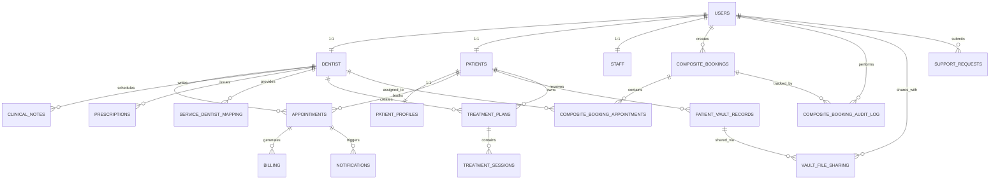
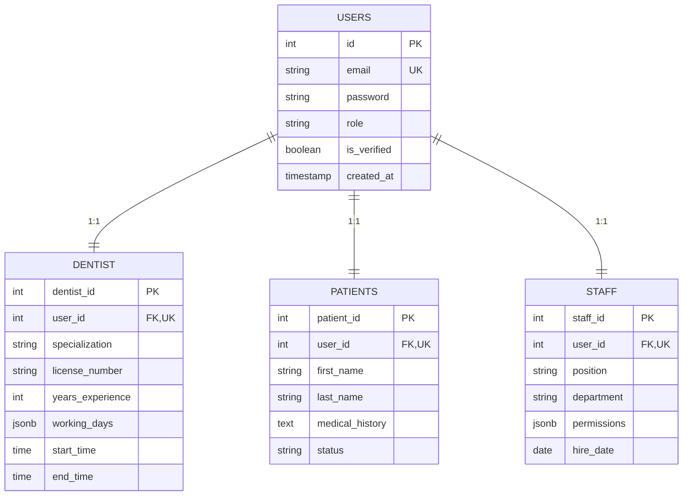
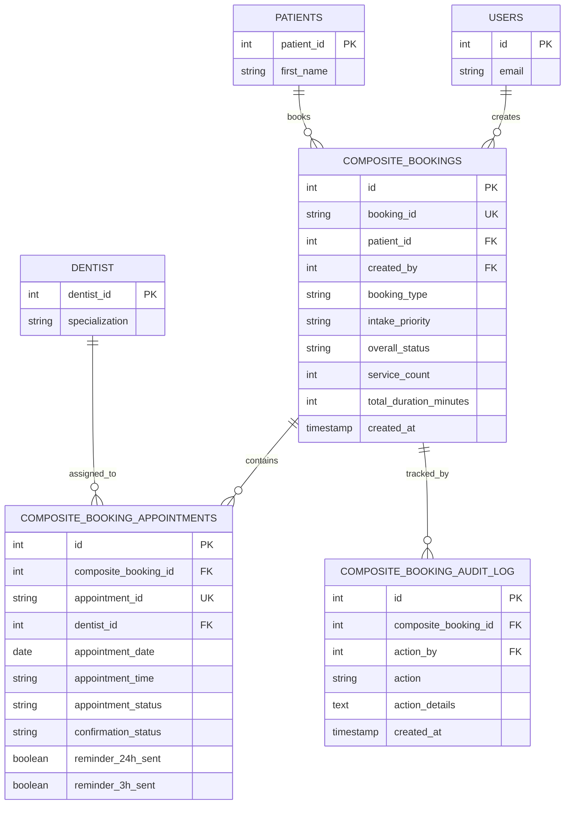
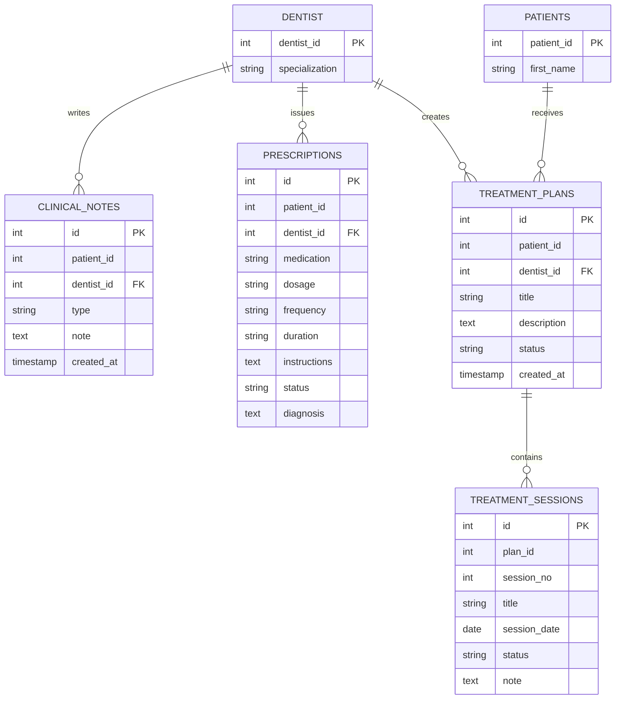
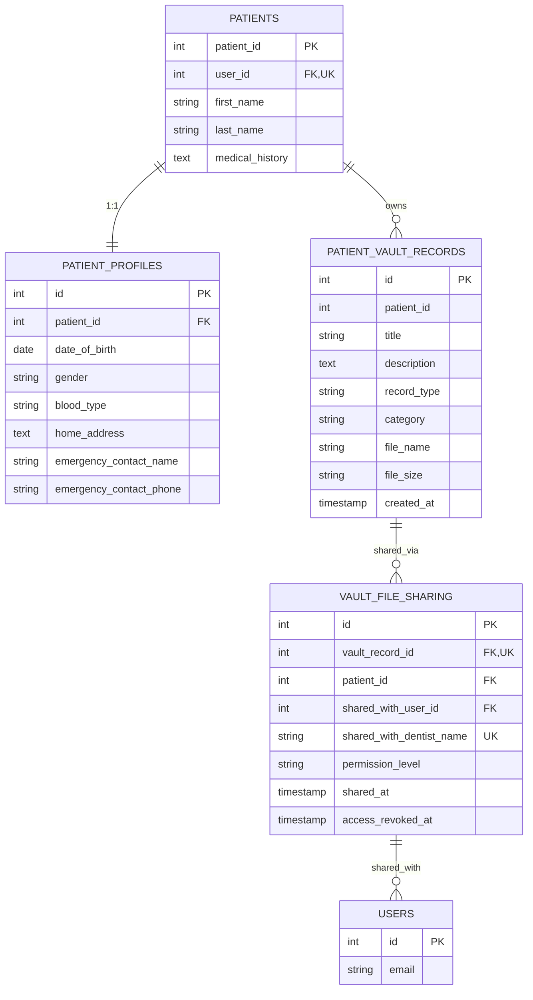
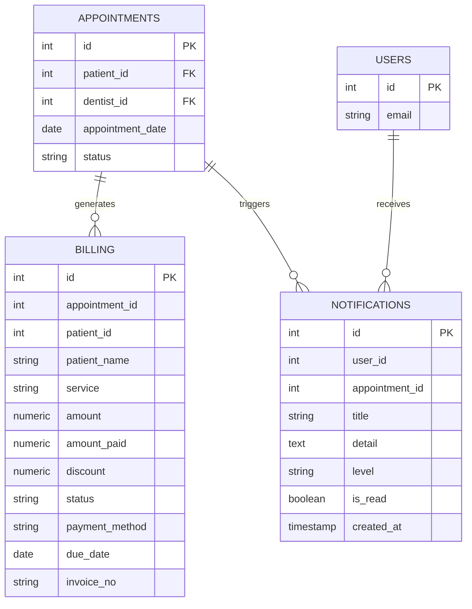
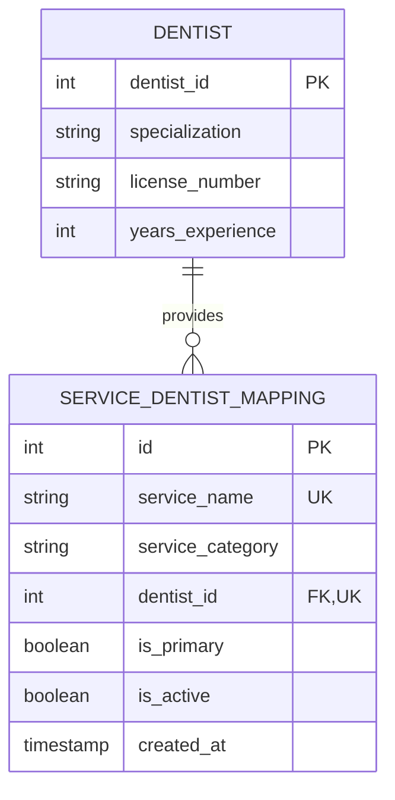
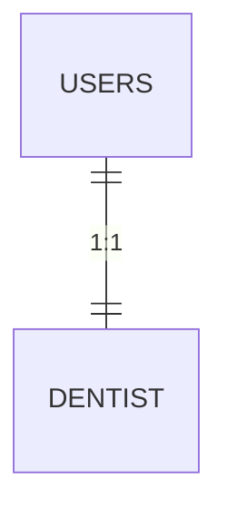

# 🔗 Mermaid Live - Direct Links & Quick Reference

## 📊 How to Use Mermaid Live

### Step 1: Open Mermaid Live
Go to: **https://mermaid.live**

### Step 2: Copy Diagram Code
Choose a diagram from the sections below and copy the code

### Step 3: Paste & View
Paste the code into the Mermaid Live editor and it will render instantly

### Step 4: Export or Share
- **Export:** Click "Download" to save as PNG/SVG
- **Share:** Click "Share" to get a shareable link
- **Edit:** Make changes directly in the editor

---

## 🎯 Quick Diagram Codes

### 1️⃣ FULL ERD (All 20 Tables)



---

### 2️⃣ USER MANAGEMENT



---

### 3️⃣ BOOKING SYSTEM



---

### 4️⃣ CLINICAL RECORDS



---

### 5️⃣ MEDICAL VAULT



---

### 6️⃣ BILLING & NOTIFICATIONS



---

### 7️⃣ SERVICES & DENTIST MAPPING



---

## 📋 Legend & Symbols

| Symbol | Meaning | Example |
|--------|---------|---------|
| `PK` | Primary Key | `int id PK` |
| `FK` | Foreign Key | `int user_id FK` |
| `UK` | Unique Key | `string email UK` |
| `\|\|--\|\|` | One-to-One | `USERS \|\|--\|\| DENTIST` |
| `\|\|--o{` | One-to-Many | `DENTIST \|\|--o{ APPOINTMENTS` |
| `}o--o{` | Many-to-Many | `STUDENTS }o--o{ COURSES` |

---

## 🎨 Mermaid Live Features

### Themes
- **Default** - Light theme
- **Dark** - Dark theme
- **Forest** - Green theme
- **Neutral** - Grayscale

### Export Options
- **PNG** - Raster image (good for presentations)
- **SVG** - Vector image (scalable, good for web)
- **Markdown** - Copy as markdown code block

### Sharing
1. Click "Share" button
2. Get a unique URL
3. Share with team members
4. They can view and edit

---

## 💡 Pro Tips

### Tip 1: Customize Appearance
```mermaid
%%{init: {'theme':'dark'}}%%
erDiagram
    ...
```

### Tip 2: Add Comments


### Tip 3: Zoom & Pan
- **Zoom:** Scroll wheel or pinch
- **Pan:** Click and drag
- **Reset:** Double-click

### Tip 4: Copy Diagram Link
After editing, click "Share" to get a URL like:
```
https://mermaid.live/edit#pako:eNqLVkosKMnPS8wpTVWqBgAZeQUK
```

---

## 🔄 Workflow Examples

### For Documentation
1. Create diagram in Mermaid Live
2. Export as PNG
3. Add to README.md or documentation
4. Keep source code in version control

### For Presentations
1. Create diagram in Mermaid Live
2. Export as SVG
3. Insert into PowerPoint/Google Slides
4. Resize as needed

### For Team Collaboration
1. Create diagram in Mermaid Live
2. Click "Share"
3. Send URL to team
4. Team can view and suggest changes
5. Update and reshare

### For Version Control
1. Save `.md` files with diagram code
2. Commit to Git
3. GitHub/GitLab renders automatically
4. Easy to track changes

---

## 📱 Mobile Friendly

Mermaid Live works on:
- ✅ Desktop browsers
- ✅ Tablets
- ✅ Mobile phones
- ✅ All modern browsers (Chrome, Firefox, Safari, Edge)

---

## 🚀 Advanced Features

### Custom Styling
```mermaid
%%{init: {'primaryColor':'#9f51b6', 'primaryTextColor':'#fff', 'primaryBorderColor':'#7c3aed', 'lineColor':'#5a189a', 'secondBkgColor':'#c77dff', 'tertiaryTextColor':'black'}}%%
erDiagram
    ...
```

### Responsive Design
Diagrams automatically adjust to screen size

### Accessibility
- Semantic HTML
- Keyboard navigation
- Screen reader support

---

## 📞 Support & Resources

- **Official Docs:** https://mermaid.js.org
- **GitHub:** https://github.com/mermaid-js/mermaid
- **Live Editor:** https://mermaid.live
- **Examples:** https://mermaid.js.org/ecosystem/integrations.html

---

## 📝 Quick Checklist

- [ ] Copy diagram code
- [ ] Go to https://mermaid.live
- [ ] Paste code in editor
- [ ] View rendered diagram
- [ ] Customize if needed
- [ ] Export or share
- [ ] Save source code

---

## 🎯 Common Use Cases

### 1. Database Design Review
- Share ERD with team
- Get feedback
- Update and reshare

### 2. Documentation
- Include in README
- Add to wiki
- Reference in PRs

### 3. Presentations
- Export as image
- Insert into slides
- Present to stakeholders

### 4. Learning
- Understand relationships
- Study schema
- Learn database design

### 5. Planning
- Design new features
- Plan migrations
- Document changes

---

**Last Updated:** May 24, 2026  
**Database:** PostgreSQL (code_smiles_db)  
**Total Tables:** 20  
**Mermaid Live:** https://mermaid.live
