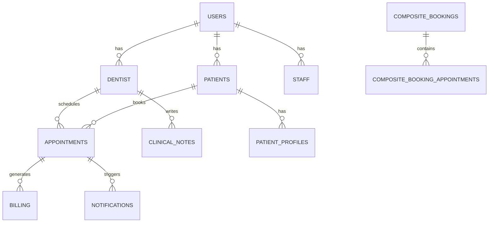

# Slide 7 — Database Design: Step-by-Step Creation Guide

## 📋 Overview
This guide shows you exactly how to create Slide 7 in PowerPoint with the database design, ER diagram, and table relationships.

---

## 🎯 Slide 7 Structure

Your slide should have:
1. **Title**: "Database Design"
2. **Subtitle**: "ER Diagram & Database Tables"
3. **Main Content**: ER diagram visual
4. **Supporting Content**: Key tables and relationships

---

## 📝 Step 1: Create the Slide Title

### In PowerPoint:
1. Click **Insert** → **New Slide**
2. Choose **Title and Content** layout
3. Click on the title placeholder
4. Type: **"Slide 7 — Database Design"**
5. Format:
   - Font: Arial or Calibri
   - Size: 44pt
   - Bold: Yes
   - Color: Dark blue (#1976D2)

---

## 🎨 Step 2: Add Subtitle

1. Click below the title
2. Add a text box with: **"ER Diagram • Database Tables • Relationships"**
3. Format:
   - Font: Arial
   - Size: 20pt
   - Color: Gray (#757575)

---

## 📊 Step 3: Create the ER Diagram

### Option A: Simple Text-Based Diagram (Easiest)

1. Click **Insert** → **Text Box**
2. Draw a text box in the center of the slide
3. Type the following diagram:

```
                    USERS (Core)
                        │
        ┌───────────────┼───────────────┐
        │               │               │
    DENTIST         PATIENTS          STAFF
        │               │
    ┌───┴────┐          │
    │        │          │
APPOINTMENTS  CLINICAL  PATIENT_PROFILES
    │        NOTES      │
    │        │          │
COMPOSITE_BOOKINGS  TREATMENT_PLANS
    │                   │
COMPOSITE_BOOKING_  TREATMENT_
APPOINTMENTS        SESSIONS

SERVICE_DENTIST_MAPPING
PATIENT_VAULT_RECORDS
VAULT_FILE_SHARING
BILLING
NOTIFICATIONS
```

4. Format:
   - Font: Courier New (monospace)
   - Size: 11pt
   - Color: Black
   - Background: Light gray (#F5F5F5)

---

### Option B: Visual Diagram (More Professional)

1. Click **Insert** → **Shapes**
2. Draw rectangles for each table:
   - **USERS** (center, blue)
   - **DENTIST** (left, green)
   - **PATIENTS** (center, green)
   - **STAFF** (right, green)
   - **APPOINTMENTS** (below DENTIST, yellow)
   - **CLINICAL_NOTES** (below DENTIST, yellow)
   - **PATIENT_PROFILES** (below PATIENTS, yellow)
   - **COMPOSITE_BOOKINGS** (below APPOINTMENTS, orange)
   - **TREATMENT_PLANS** (below CLINICAL_NOTES, orange)

3. Add connecting lines:
   - Click **Insert** → **Connector**
   - Draw lines from USERS to DENTIST, PATIENTS, STAFF
   - Draw lines from DENTIST to APPOINTMENTS, CLINICAL_NOTES
   - Draw lines from PATIENTS to PATIENT_PROFILES
   - Draw lines from APPOINTMENTS to COMPOSITE_BOOKINGS
   - Draw lines from CLINICAL_NOTES to TREATMENT_PLANS

4. Add labels on lines:
   - "1:1" for one-to-one relationships
   - "1:N" for one-to-many relationships

---

## 📋 Step 4: Add Key Tables Section

### Create a Table with Main Tables

1. Click **Insert** → **Table**
2. Create a table with 3 columns and 8 rows:

| Table Name | Purpose | Key Fields |
|---|---|---|
| **USERS** | Central authentication | id, email, password_hash, role |
| **DENTIST** | Dentist profiles | dentist_id, user_id, specialization |
| **PATIENTS** | Patient profiles | patient_id, user_id, phone |
| **COMPOSITE_BOOKINGS** | Multi-appointment bookings | id, booking_id, patient_id, status |
| **COMPOSITE_BOOKING_APPOINTMENTS** | Individual appointments | id, appointment_id, dentist_id, date |
| **CLINICAL_NOTES** | Doctor's notes | id, dentist_id, patient_id, content |
| **PATIENT_VAULT_RECORDS** | Medical documents | id, patient_id, file_name, file_path |

3. Format the table:
   - Header row: Bold, blue background (#1976D2), white text
   - Alternating row colors: White and light gray (#F5F5F5)
   - Font: Arial, 11pt
   - Borders: Light gray

---

## 🔗 Step 5: Add Relationships Section

### Create a Relationships Box

1. Click **Insert** → **Text Box**
2. Add the following content:

```
KEY RELATIONSHIPS

One-to-One (1:1):
• USERS ↔ DENTIST
• USERS ↔ PATIENTS
• USERS ↔ STAFF

One-to-Many (1:N):
• DENTIST → APPOINTMENTS
• DENTIST → CLINICAL_NOTES
• PATIENTS → APPOINTMENTS
• COMPOSITE_BOOKINGS → COMPOSITE_BOOKING_APPOINTMENTS
```

3. Format:
   - Font: Arial, 11pt
   - Color: Dark gray (#424242)
   - Background: Light blue (#E3F2FD)
   - Padding: 10px

---

## 📊 Step 6: Add Data Flow Diagram

### Create a Simple Flow

1. Click **Insert** → **Shapes** → **Flowchart**
2. Create boxes for:
   - Patient/Staff Creates Booking
   - COMPOSITE_BOOKINGS
   - COMPOSITE_BOOKING_APPOINTMENTS
   - DENTIST (Assign)
   - NOTIFICATIONS
   - BILLING

3. Connect with arrows showing the flow

4. Format:
   - Box color: Light blue (#E3F2FD)
   - Arrow color: Dark blue (#1976D2)
   - Text: Arial, 10pt

---

## 🎯 Step 7: Add Key Features Box

### Create a Highlights Section

1. Click **Insert** → **Text Box**
2. Add bullet points:

```
✓ 20 Tables organized in 7 layers
✓ Supports multiple user types
✓ Complete audit trail
✓ Foreign key constraints
✓ Normalized schema
✓ Indexed for performance
```

3. Format:
   - Font: Arial, 12pt
   - Color: Green (#4CAF50)
   - Bold: Yes

---

## 🎨 Step 8: Design & Layout

### Recommended Layout

```
┌─────────────────────────────────────────────────────┐
│ Slide 7 — Database Design                           │
│ ER Diagram • Database Tables • Relationships         │
├─────────────────────────────────────────────────────┤
│                                                     │
│  ┌──────────────────────────────────────────────┐  │
│  │         ER DIAGRAM VISUAL                    │  │
│  │  (Text-based or shapes diagram)              │  │
│  │                                              │  │
│  │         USERS (center)                       │  │
│  │      ↙    ↓    ↘                             │  │
│  │   DENTIST PATIENTS STAFF                     │  │
│  │      ↓       ↓                               │  │
│  │   APPTS   PROFILES                           │  │
│  │                                              │  │
│  └──────────────────────────────────────────────┘  │
│                                                     │
│  KEY TABLES:                    KEY RELATIONSHIPS: │
│  • USERS                        • 1:1 Relationships│
│  • DENTIST                      • 1:N Relationships│
│  • PATIENTS                     • Foreign Keys    │
│  • COMPOSITE_BOOKINGS          • Audit Trail     │
│  • APPOINTMENTS                                   │
│  • CLINICAL_NOTES                                │
│  • PATIENT_VAULT_RECORDS                         │
│                                                     │
│  ✓ 20 Tables  ✓ Audit Trail  ✓ Normalized       │
│                                                     │
└─────────────────────────────────────────────────────┘
```

---

## 📐 Step 9: Formatting Tips

### Colors to Use
- **Primary Blue**: #1976D2 (headers, main elements)
- **Success Green**: #4CAF50 (checkmarks, highlights)
- **Light Gray**: #F5F5F5 (backgrounds)
- **Dark Gray**: #424242 (text)

### Fonts
- **Headers**: Arial Bold, 24-28pt
- **Subheaders**: Arial Bold, 16-18pt
- **Body Text**: Arial Regular, 11-12pt
- **Code/Tables**: Courier New, 10-11pt

### Spacing
- Top margin: 0.5"
- Bottom margin: 0.5"
- Left/right margins: 0.75"
- Between sections: 0.25"

---

## 🖼️ Step 10: Add Visual Elements

### Optional Enhancements

1. **Add Icons**:
   - Database icon for tables
   - Link icon for relationships
   - Lock icon for security

2. **Add Colors**:
   - Blue for USERS table
   - Green for profile tables
   - Yellow for appointment tables
   - Orange for booking tables

3. **Add Shadows**:
   - Right-click shapes
   - Select **Shape Effects** → **Shadow**
   - Choose **Offset Bottom Right**

---

## ✅ Step 11: Final Checklist

Before presenting, verify:

- [ ] Title is clear and visible
- [ ] ER diagram is easy to understand
- [ ] All 20 tables are mentioned
- [ ] Relationships are clearly shown
- [ ] Key features are highlighted
- [ ] Colors are consistent
- [ ] Text is readable from distance
- [ ] No spelling errors
- [ ] Slide fits on one page
- [ ] Transitions are smooth

---

## 🎬 Step 12: Presentation Tips

### When Presenting Slide 7:

1. **Start with the title**: "This is our database design"

2. **Explain the structure**: 
   - "We have 20 tables organized in 7 layers"
   - "The USERS table is the central hub"

3. **Point to the diagram**:
   - "USERS connects to DENTIST, PATIENTS, and STAFF"
   - "Each has their own profile table"

4. **Highlight relationships**:
   - "We use one-to-one relationships for user profiles"
   - "One-to-many for appointments and records"

5. **Emphasize key features**:
   - "Complete audit trail for compliance"
   - "Foreign key constraints ensure data integrity"
   - "Normalized schema reduces redundancy"

6. **Answer questions**:
   - "Why 20 tables?" → Organized, scalable, maintainable
   - "Why composite bookings?" → Support multi-appointment bookings
   - "How do you prevent double-booking?" → Real-time availability checking

---

## 📊 Alternative: Using Mermaid Diagram

If you want a more professional ER diagram, use Mermaid:

1. Go to **mermaid.live**
2. Paste this code:



3. Screenshot the diagram
4. Insert into PowerPoint

---

## 🎯 Quick Summary

**Slide 7 should show:**
1. ✅ Title: "Database Design"
2. ✅ ER Diagram with 20 tables
3. ✅ Key tables explained
4. ✅ Relationships (1:1, 1:N)
5. ✅ Data flow
6. ✅ Key features highlighted

**Time to create**: 15-20 minutes  
**Difficulty**: Easy to Medium  
**Tools needed**: PowerPoint, optional (Mermaid for diagram)

---

## 📁 Reference Files

- `SLIDE_7_DATABASE_DESIGN.md` - Detailed content
- `CODE_SMILES_ERD.md` - Complete ER diagram
- `ERD_PLANTUML.puml` - PlantUML diagram code

---

**Last Updated**: May 24, 2026  
**Status**: Ready to Use
