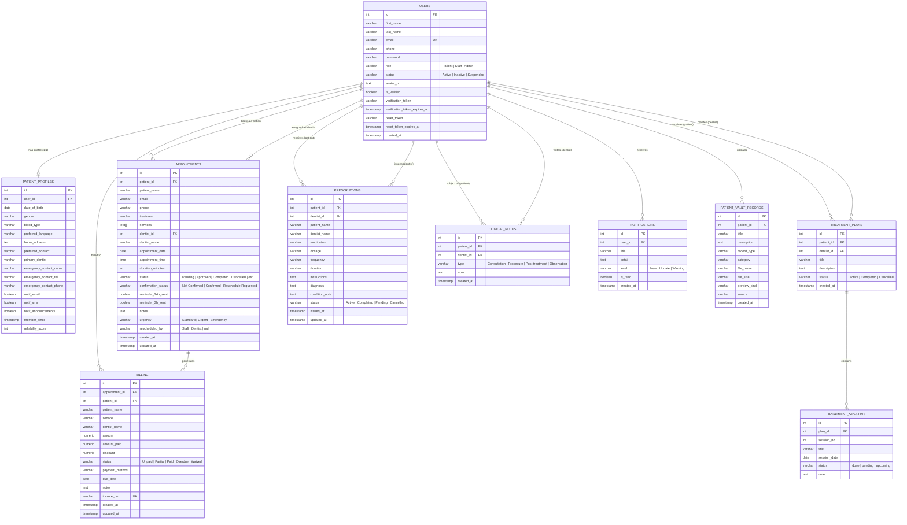

# Code Smiles — Entity Relationship Diagram

Paste the code block below into https://mermaid.live to render the ERD.

```mermaid
erDiagram

    USERS {
        int     id                            PK
        varchar first_name
        varchar last_name
        varchar email                         UK
        varchar phone
        varchar password
        varchar role                          "Patient | Staff | Admin"
        varchar status                        "Active | Inactive | Suspended"
        text    avatar_url
        boolean is_verified
        varchar verification_token
        timestamp verification_token_expires_at
        varchar reset_token
        timestamp reset_token_expires_at
        timestamp created_at
    }

    PATIENT_PROFILES {
        int     id                      PK
        int     user_id                 FK
        date    date_of_birth
        varchar gender
        varchar blood_type
        varchar preferred_language
        text    home_address
        varchar preferred_contact
        varchar primary_dentist
        varchar emergency_contact_name
        varchar emergency_contact_rel
        varchar emergency_contact_phone
        boolean notif_email
        boolean notif_sms
        boolean notif_announcements
        timestamp member_since
        int     reliability_score
    }

    APPOINTMENTS {
        int     id                  PK
        int     patient_id          FK
        varchar patient_name
        varchar email
        varchar phone
        varchar treatment
        text[]  services
        int     dentist_id          FK
        varchar dentist_name
        date    appointment_date
        time    appointment_time
        int     duration_minutes
        varchar status              "Pending | Approved | Completed | Cancelled | etc."
        varchar confirmation_status "Not Confirmed | Confirmed | Reschedule Requested"
        boolean reminder_24h_sent
        boolean reminder_3h_sent
        text    notes
        varchar urgency             "Standard | Urgent | Emergency"
        varchar rescheduled_by      "Staff | Dentist | null"
        timestamp created_at
        timestamp updated_at
    }

    TREATMENT_PLANS {
        int     id          PK
        int     patient_id  FK
        int     dentist_id  FK
        varchar title
        text    description
        varchar status      "Active | Completed | Cancelled"
        timestamp created_at
    }

    TREATMENT_SESSIONS {
        int     id          PK
        int     plan_id     FK
        int     session_no
        varchar title
        date    session_date
        varchar status      "done | pending | upcoming"
        text    note
    }

    PRESCRIPTIONS {
        int     id              PK
        int     patient_id      FK
        int     dentist_id      FK
        varchar patient_name
        varchar dentist_name
        varchar medication
        varchar dosage
        varchar frequency
        varchar duration
        text    instructions
        text    diagnosis
        text    condition_note
        varchar status          "Active | Completed | Pending | Cancelled"
        timestamp issued_at
        timestamp updated_at
    }

    CLINICAL_NOTES {
        int     id          PK
        int     patient_id  FK
        int     dentist_id  FK
        varchar type        "Consultation | Procedure | Post-treatment | Observation"
        text    note
        timestamp created_at
    }

    NOTIFICATIONS {
        int     id          PK
        int     user_id     FK
        varchar title
        text    detail
        varchar level       "New | Update | Warning"
        boolean is_read
        timestamp created_at
    }

    BILLING {
        int         id              PK
        int         appointment_id  FK
        int         patient_id      FK
        varchar     patient_name
        varchar     service
        varchar     dentist_name
        numeric     amount
        numeric     amount_paid
        numeric     discount
        varchar     status          "Unpaid | Partial | Paid | Overdue | Waived"
        varchar     payment_method
        date        due_date
        text        notes
        varchar     invoice_no      UK
        timestamp   created_at
        timestamp   updated_at
    }

    PATIENT_VAULT_RECORDS {
        int     id          PK
        int     patient_id  FK
        varchar title
        text    description
        varchar record_type
        varchar category
        varchar file_name
        varchar file_size
        varchar preview_kind
        varchar source
        timestamp created_at
    }

    %% ── Relationships ──────────────────────────────────────────────────────

    USERS                ||--o| PATIENT_PROFILES      : "has profile (1:1)"
    USERS                ||--o{ APPOINTMENTS           : "books as patient"
    USERS                ||--o{ APPOINTMENTS           : "assigned as dentist"
    USERS                ||--o{ TREATMENT_PLANS        : "receives (patient)"
    USERS                ||--o{ TREATMENT_PLANS        : "creates (dentist)"
    USERS                ||--o{ PRESCRIPTIONS          : "receives (patient)"
    USERS                ||--o{ PRESCRIPTIONS          : "issues (dentist)"
    USERS                ||--o{ CLINICAL_NOTES         : "subject of (patient)"
    USERS                ||--o{ CLINICAL_NOTES         : "writes (dentist)"
    USERS                ||--o{ NOTIFICATIONS          : "receives"
    USERS                ||--o{ BILLING                : "billed to"
    USERS                ||--o{ PATIENT_VAULT_RECORDS  : "uploads"
    APPOINTMENTS         ||--o{ BILLING                : "generates"
    TREATMENT_PLANS      ||--o{ TREATMENT_SESSIONS     : "contains"
```
